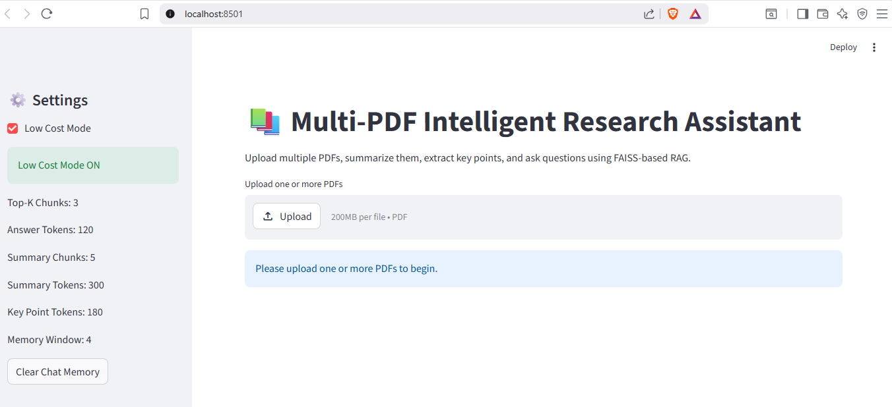
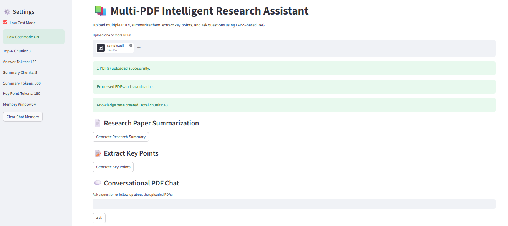
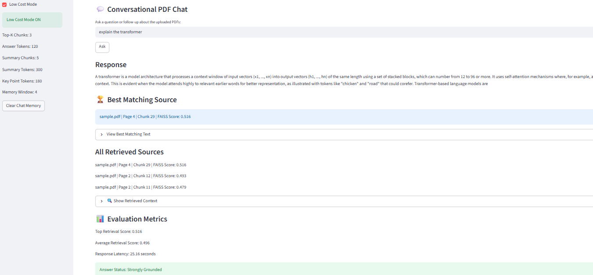
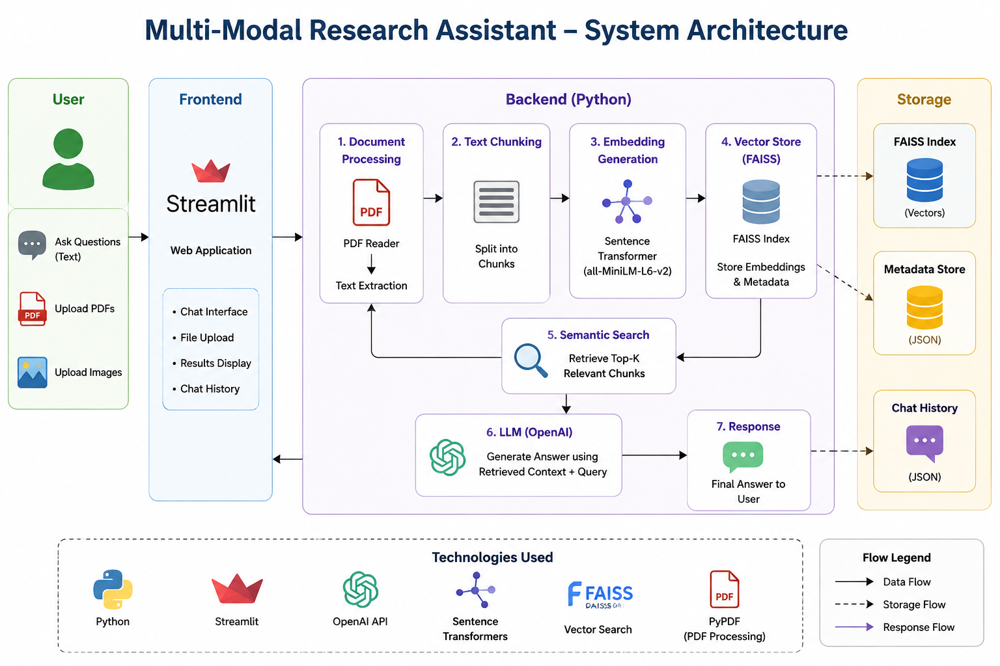

# 🧠 Multimodal Research Assistant

An AI-powered Multimodal Research Assistant that enables users to interact with PDFs, images, and text using Retrieval-Augmented Generation (RAG), semantic search, and Large Language Models (LLMs).

## 🚀 Features

- 📄 PDF Question Answering
- 🖼️ Image Understanding
- 🔍 Semantic Search using FAISS
- 🤖 LLM-based Conversational Assistant
- 💬 Chat Memory
- ⚡ Fast Retrieval-Augmented Generation (RAG)
- 📚 Document Chunking & Embedding Generation

---

## 🏗️ Project Architecture

```
                  User Query
                      │
                      ▼
          ┌──────────────────────┐
          │  Streamlit Frontend   │
          └──────────┬────────────┘
                     │
                     ▼
         ┌─────────────────────────┐
         │   Backend (Python)      │
         └──────────┬──────────────┘
                    │
      ┌─────────────┼──────────────┐
      ▼             ▼              ▼
 PDF Reader     Semantic Search   Chatbot
      │             │              │
      ▼             ▼              ▼
 Chunking      FAISS Index     Memory
      │
      ▼
 Embedding Generation
      │
      ▼
    LLM Response
```

---

## 📂 Project Structure

```
multimodal-research-assistant/
│
├── backend/
│   ├── chatbot.py
│   ├── rag_chatbot.py
│   ├── semantic_search.py
│   ├── pdf_reader.py
│   ├── chunk_pdf.py
│   ├── create_embeddings.py
│   └── faiss_index.py
│
├── frontend/
│   └── app.py
│
├── data/
│   └── pdfs/
│
├── docs/
│
├── Dockerfile
├── requirements.txt
├── .gitignore
└── README.md
```

---

## 🛠️ Technologies Used

- Python
- Streamlit
- FAISS
- OpenAI / LLM
- LangChain
- NumPy
- Docker

---

## ⚙️ Installation

Clone the repository

```bash
git clone https://github.com/Akhil-2024/multimodal-research-assistant.git
```

Move into the project

```bash
cd multimodal-research-assistant
```

Create a virtual environment

```bash
python -m venv venv
```

Activate the virtual environment

### Windows

```bash
venv\Scripts\activate
```

### Linux / macOS

```bash
source venv/bin/activate
```

Install dependencies

```bash
pip install -r requirements.txt
```

Run the application

```bash
streamlit run frontend/app.py
```

---

## Screenshots

### Application Home



### Chat Interface



### Generated Result



## Architecture



## 📌 Future Improvements

- Voice Assistant
- Multi-language Support
- Research Paper Summarization
- Citation Generation
- OCR for Scanned PDFs
- Cloud Deployment

---

## 👨‍💻 Author

**Akhilesh Kumar Patel**

M.Tech (Control & Automation)

Indian Institute of Technology Delhi

GitHub: https://github.com/Akhil-2024
